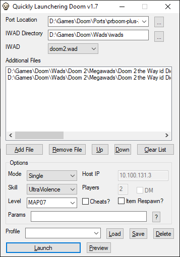

## It's a Doom launcher!



It's main goal is to be very simple and lightweight. You shouldn't need a lot of BS to play some Doom!
To that end it is a standalone <1MB executable with no dependencies and portable configuration.
Drop it in a directory and you're done.

### Supported Ports

Most sane ports should work fine, but I've only really tried the following [ports.

+ (G)zdoom
+ chocolate doom / crispy doom
+ prboom+
+ zandronum (for most things)

### Supported file types
These are the file types that the launcher knows the appropriate command line parameter for.

+ wad, pk3, pk7
+ zdoom savegames (zds)
+ chocolate doom savegames (dsg)
+ ini files
+ cfg files (-config in chocolate, +exec in zdoom/zandronum)
+ demo lumps
+ deh files

Sorry, no support for loading directories in zdoom yet. I need to add that.

### A Brief Guide To Doing Doom Stuff

#### Example Setup for GZDoom
1. Download the latest release from https://github.com/SavageMessiah/QLZ/releases Stick the exe in your gzdoom directory.
2. Copy your doom.wad, doom2.wad, etc from wherever they are now into the gzdoom directory.
3. Run launcher.exe
4. Select gzdoom.exe for the gzdoom location
5. Select your gzdoom directory as the IWAD directory

#### How I set things up
If you want to use a bunch of ports and keep a hefty stash of wads around, you might try a scheme like this:

```
doom
    ports
        gzdoom
        etc
        Launcher.exe
    iwads
    wads
```

#### To Play Something
1. Select the IWAD you want from the list
2. Click and drag the wads you want into additional files
3. Use up and down to rearrange the files if needed - sometimes load order matters.
4. Click Launch

It will remember all those settings between runs. If you want to switch between different things you play a lot, type a name in for the profile (at the bottom) and click save. Then you can switch profiles by selecting one and clicking load.

I rather like adding my gzdoom savegame to my profile for a megawad that I'm playing (I usually only play 1 or 2 levels at a time). Then I can just hit launch and get dropped right back into the action.
